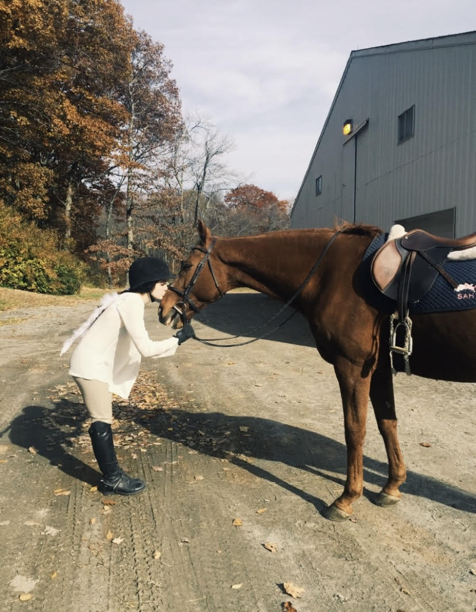
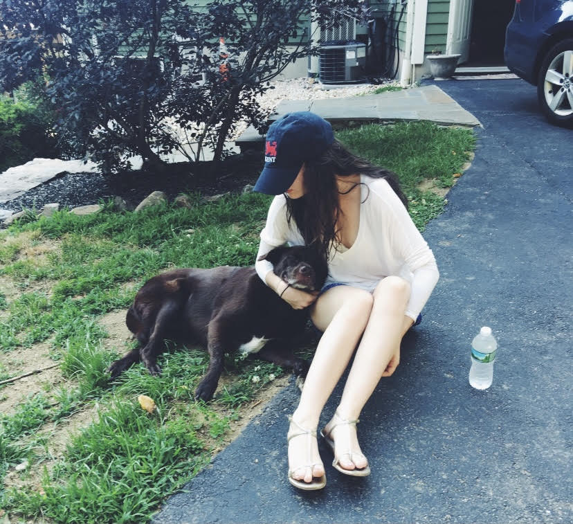

## **About Sydney**

# I am a current senior at Quinnipiac University which is located in Hamden, CT. I am currently studying Computer Science and Graphic Design. I grew up in Pawling, New York on a farm and love the outdoors!

Here's some images of my love for my animals!

# **Skills:**

## **Coding Skills:**
1. Java
2. Python
3. C++
4. HTML
5. CSS
6. SQL

## **Computer Skills:**
1. Microsoft Office 365
2. Adobe Creative Cloud
3. Peachtree accounting software

## **Interests:**
Horse Back Riding, Cooking, Hiking

# **Previous Work Experience:**

## Cornell Cooperative Extension, Brewster, NY Summer Internship, May 2020 - August 2020
• Instructed 4-H Video Production and Video Game Design courses via Zoom for duration of six weeks.

• Provided technical assistance to office staff when needed.

• Created graphic designs to use for promotions.

## Checkpoint Consulting LLC, Detroit, MI Summer Internship, May 2019 - August 2019
• Assisted in writing requirements and design documentation.

• Formatted prototype files using Excel.

• Developed test scripts for web-based applications.

## Corinthian Partners LLC, New York, NY Summer Internship, May 2018 - August 2018
• Assisted with troubleshooting issues and developed solutions to numerous programs as well as general OS issues on the fly.

• Assisted in general software upgrades.

• Researched investment options.

## Stages Childcare, Pawling, NY Assistant Teacher, April 2018 – January 2019
• Supervised and engaged children with age appropriate activities between Newborn and School-Aged classrooms.

• Ensured cleanliness and took precautions to prevent accidents.
